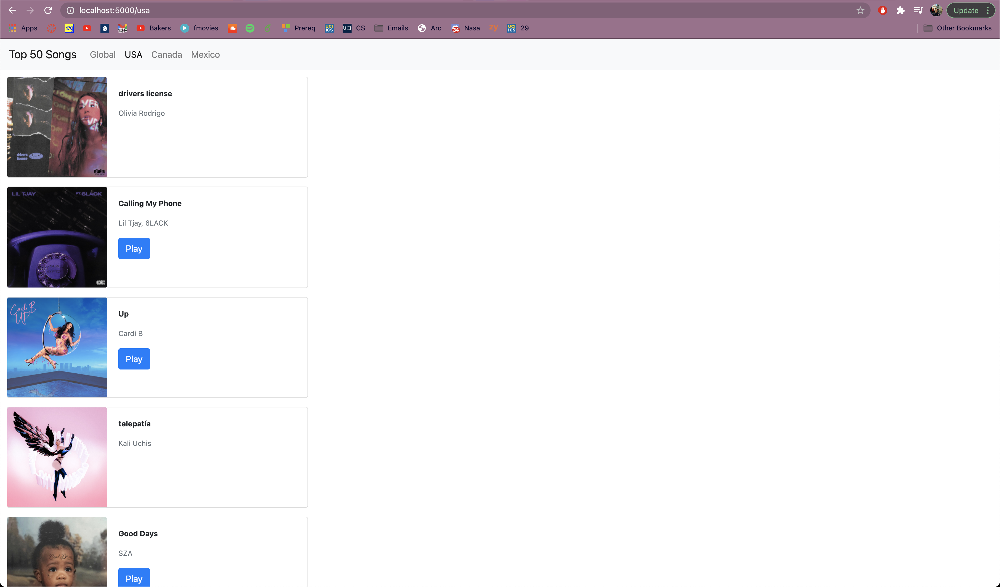
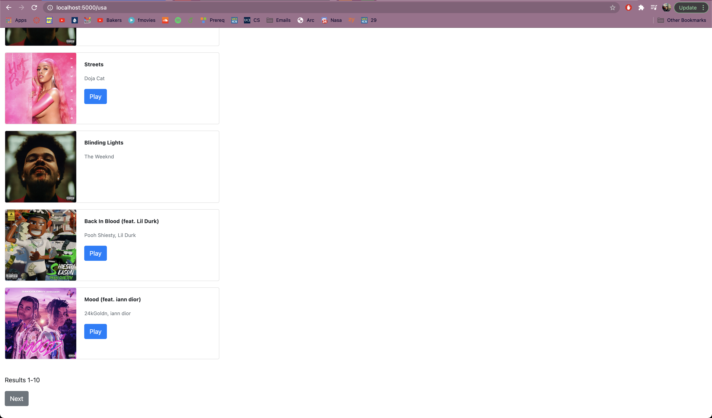

# Current Top 50 Songs
### Web app that shows you the top 50 trending songs (global, USA, Mexico, or in Canada).

1.) Install python dependencies: pip install -r requirements.txt

2.) Install npm dependencies: npm install

3.) Run app: python3 -m flask run

